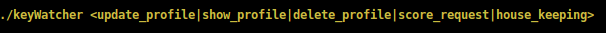
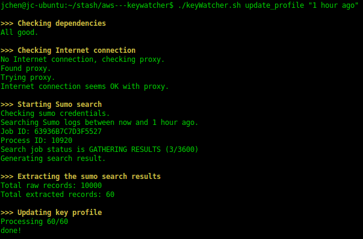
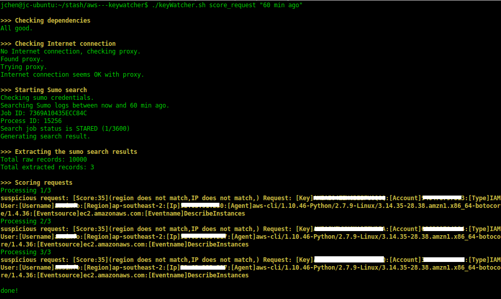

## keyWatcher

### Description
We have seen multiple times that users accidentally expose their AWS access key and secret key on Internet, e.g. GitHub. This is a really dangerous thing, as whoever get that key can do whatever you can do to your AWS account. Here are two examples, the exposed key was used by someone unknown to create large number of EC2 instance to do BitCoin mining.   

[Dev put AWS keys on Github. Then BAD THINGS happened](http://www.theregister.co.uk/2015/01/06/dev_blunder_shows_github_crawling_with_keyslurping_bots/)  
[Ryan Hellyer’s AWS Nightmare: Leaked Access Keys Result in a $6,000 Bill Overnight](https://wptavern.com/ryan-hellyers-aws-nightmare-leaked-access-keys-result-in-a-6000-bill-overnight)   

If it only costs your fortune, then you are lucky! The worst thing is that they can permanently remove everything you built. [Code Space](http://www.infoworld.com/article/2608076/data-center/murder-in-the-amazon-cloud.html) closed door just because of this.  

Check out the [Best Practices for Managing AWS Access Keys](http://docs.aws.amazon.com/general/latest/gr/aws-access-keys-best-practices.html) to secure your AWS key. If unfortunately it has already happened, then follow the guide of [What to Do If Your Inadvertently Expose an AWS Access Key](https://blogs.aws.amazon.com/security/post/Tx1P6IGLLZ935I4/What-to-Do-If-You-Inadvertently-Expose-an-AWS-Access-Key) as soon as possbile.

Proactive prevention is very necessary, and passive monitor is also needed. CloudTrail keeps records of all AWS API calls, so it should always be enabled. KeyWatcher is a bash scritp that I wrote to monitor the AWS API calls logged by CloudTrail, then scores them based on the established key profile which combines of a few factors.

### Design

The blue zone is the logging infrastructure. We turn on CloudTrail in each AWS account and consolidate them into one S3 bucket. Then setup a collector in Sumologic to periodcally import the Cloudtrail logs. 

The green zone is keyWatcher, it is simply a bash script plus a redis server. The bash scritp keyWatcher.sh has two main functions - update key profile and score the API call requests. Redis is where the key profiles are saved.

### How it works?

Firstly, you need to build profiles for keys manually. The profile is based on the Cloudtrail logs in the past a period of time (24 hours for example). It records the key is used from where (source IP), by what (agent), to where (region) and do what (event). Here is how the profile for key AHATHISISAFAKEKEY looks like:   

 1) "[Key]AHATHISISAFAKEKEY:[Eventname]DescribeApplications"     
 2) "[Key]AHATHISISAFAKEKEY:[Eventname]DescribeEnvironments"     
 3) "[Key]AHATHISISAFAKEKEY:[Eventname]ListAvailableSolutionStacks"
 4) "[Key]AHATHISISAFAKEKEY:[Eventname]UpdateEnvironment"     
 5) "[Key]AHATHISISAFAKEKEY:[Account]1234567890:[Username]jackie.chen"    
 6) "[Key]AHATHISISAFAKEKEY:[Ip]111.111.111.111"     
 7) "[Key]AHATHISISAFAKEKEY:[Eventname]ListInstanceProfiles"    
 8) "[Key]AHATHISISAFAKEKEY:[Eventname]DescribeDBSnapshots"     
 9) "[Key]AHATHISISAFAKEKEY:[Eventname]DescribeEnvironmentResources"    
10) "[Key]AHATHISISAFAKEKEY:[Region]ap-southeast-2"    
11) "[Key]AHATHISISAFAKEKEY:[Eventname]ListServerCertificates"    
12) "[Key]AHATHISISAFAKEKEY:[Agent]signin.amazonaws.com"    
13) "[Key]AHATHISISAFAKEKEY:[Eventname]DescribeConfigurationOptions"   
14) "[Key]AHATHISISAFAKEKEY:[Eventname]DescribeEvents"    
15) "[Key]AHATHISISAFAKEKEY:[Eventname]DescribeApplicationVersions"     
16) "[Key]AHATHISISAFAKEKEY:[Eventname]DescribeConfigurationSettings"    
17) "[Key]AHATHISISAFAKEKEY:[Region]us-east-1"    
18) "[Key]AHATHISISAFAKEKEY:[Eventname]ListRoles"    
19) "[Key]AHATHISISAFAKEKEY:[Eventname]ListCertificates"    

Secondly, manually or set up a cronjob to run keyWatcher to analyse and score the API calls in the past a period of time (10 minutes for example). keyWacher extracts the info from Cloudtrail and form it into this format for each call: [Key]*[Account]*[Type]*[Username]*[Region]*[Ip]*[Agent]*[Eventsrouce]*[Eventname], then scores it using this scoring system: source IP address (40), agent (25), aws region (25) and event (10). If a factor is matched, then its associated weight will be added to the total score. 

Still use key AHATHISISAFAKEKEY as a example. This is how the extracted info looks like:   

[Key]AHATHISISAFAKEKEY:[Account]1234567890:[Type]IAMUser:[Username]jackie.chen:[Region]ap-southeast-2:[Ip]222.222.222.222:[Agent]signin.amazonaws.com:[Eventsource]rds.amazonaws.com:[Eventname]DescribeDBSnapshots. 

Compare it with the key profile, you can see the only thing that does not match is the [Ip]. So the total score is agent(25) + region(25) + event(10) = 60. If the total score is lower than 70, it will be considered as suspicious.

### How to use?

#### Update key profile   
This is to build the key's profile based on Cloudtrail logs in the past a period of time. By default it is for all keys based on the past 1 day logs. Each key profile has 4 factors and each factor has a associated weight: source IP address (40), agent (25), aws region (25) and event (10). You can also specify the period or period and key.    

*Note*: keyWatcher excludes the temporary access keys that are generated via assumed role or SSO login, and AWS internal service API call.      

Example:      
./keyWatcher update_profile "1 hour ago"    
./keyWatcher update_profile "1 hour ago" "AHATHISISAFAKEKEY"    

#### Show key profile
This is to show the information of key profiles based on keywords.   

Example:   
./keyWatcher show_profile      

#### Delete key profile  
This is to delete a key or all keys profile.   

Example:  
./keyWatcher delete_profile

#### Export or Import key profile   
This allows you to export or import key profile.    

Example:   
./keyWatcher export_profile   
./keyWatcher import_profile   

#### Score API call requests  
This is to score each API call requests in the past 10 minutes by default. You can overwrite it by specifying the period or period and key. The score starts as 0, if the factor is matched then its associated weight will be added to the total score. So generally, the higher score means the request is more trustable.  If the total score is lower than 70, it will be reported as suspicious API request.    

Example:   
./keyWatcher score_requst   
./keyWatcher score_requst "30 min ago"   
./keyWatcher score_requst "15 min ago" "AHATHISISAFAKEKEY"    

